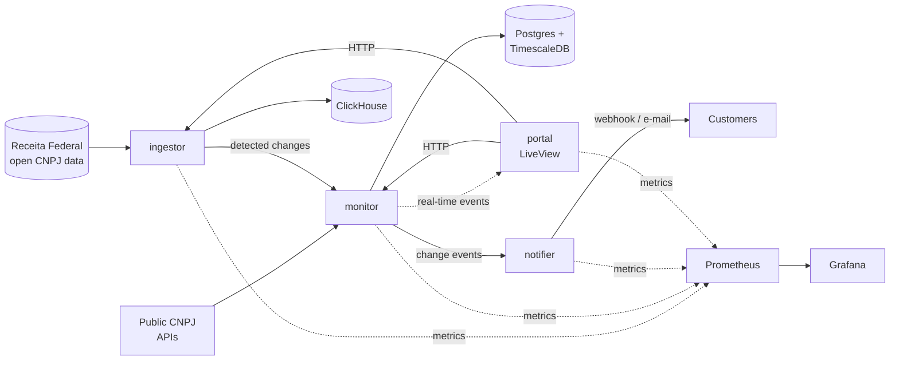

# 🐆 Lince

> Continuous monitoring of Brazilian companies: detects registry changes and alerts in real time.


*[Versão em português no final](#-em-português)*

---

## What is a CNPJ?

Every company in Brazil is identified by a **CNPJ** (*Cadastro Nacional da Pessoa Jurídica*), a
14-digit number issued by the Federal Revenue Service (*Receita Federal*). It works like a company's
tax ID and registry entry combined: behind each CNPJ there is a legal name, a registration status
(active, suspended, closed...), a list of partners, an economic activity code, an address and more.

The first 8 digits (the *CNPJ root*) identify the company; the remaining digits identify each of its
branches.

## The problem

Companies deal with other companies all the time: suppliers, customers, partners. And those
companies change: a CNPJ becomes **suspended** or **closed**, changes its **legal name**, its
**partners** or its **economic activity**.

Today this check is usually manual and one-off: someone looks up the CNPJ during onboarding and
never looks again. When the problem shows up (a payment to a closed company, an irregular supplier,
a customer with fraud risk), it is already too late.

## The solution

**Lince** (Portuguese for *lynx*) continuously watches a portfolio of CNPJs and alerts as soon as
something changes.

- 📋 **Watchlists:** each customer registers the CNPJs they want to follow.
- 🔔 **Real-time alerts:** dashboard notifications, e-mail and webhooks when a change is detected.
- 🕓 **Timeline:** full change history for each company.
- ⚠️ **Risk score:** based on registration status, company age, recent partner changes, etc.
- 📊 **Analytics:** aggregated view of the national registry, such as companies opened and closed
  by sector and state.
- 🔌 **Public API:** integration with third-party systems (ERPs, customer onboarding, compliance).

**Who it is for:** accounting firms, fintechs, compliance/KYB teams and companies with many
suppliers.

---

## Architecture

The system is split into **4 Elixir microservices** that communicate through **HTTP APIs**. Each
service owns its data: no service reads another service's database.



### Services

| Service | Port | Responsibility | Database |
|---|---|---|---|
| **portal** | 4000 | Phoenix LiveView dashboard: watchlists, real-time alerts, timeline, analytics, multi-tenant authentication | — |
| **monitor** | 4001 | Periodic checks of watched CNPJs, change detection and change history | Postgres + TimescaleDB |
| **ingestor** | 4002 | Concurrent download and processing of Receita Federal's monthly open data; month-over-month diff | ClickHouse |
| **notifier** | 4003 | Notification delivery (webhooks and e-mail) with retries and failure handling | — |

### Data

| Database | Used for | Why |
|---|---|---|
| **PostgreSQL + TimescaleDB** | Customers, watchlists and per-CNPJ change history | Transactional data with relational integrity; the change history is a time series, a natural fit for hypertables |
| **ClickHouse** | The full registry of Brazilian companies and analytical queries | Tens of millions of rows; columnar storage answers aggregate queries in seconds |

### Inside each service

Each service follows the Phoenix convention of separating the **domain** from the **web layer**:

```
lib/
├── ingestor.ex          # facade: the only public API of the domain
├── ingestor/            # business rules (pipelines, schemas); knows nothing about HTTP
└── ingestor_web/        # router, controllers and JSON views; calls only the facade
```

The web layer can change without touching business rules, and the domain can be tested without
HTTP.

---

## Repository layout

```
.
├── docker-compose.yml   # local infrastructure + tests container
├── Makefile             # shortcuts for tests and lint
├── infra/               # Prometheus, Grafana and the Elixir dev/test image
└── services/
    ├── ingestor/        # independent Mix project
    ├── monitor/         # (planned)
    ├── notifier/        # (planned)
    └── portal/          # (planned)
```

### Why a monorepo?

Microservices are defined by **how services run**, not by how many repositories hold them. Each
service here has its own container, its own database, communicates only over HTTP and never
imports code from another service. What a single repository adds is convenience: one
`docker compose up` starts the whole system, and the full architecture is visible in one place.

Independence is kept on purpose: each service has its own Mix project, its own CI workflow
(triggered only by changes in its folder) and its own README. Any service can be extracted into a
separate repository with its full history using `git subtree split --prefix=services/<name>`.

---

## Tech stack

- **Language:** Elixir / Erlang OTP
- **Web:** Phoenix, Phoenix LiveView
- **Scheduled jobs:** Oban
- **Concurrent processing:** Broadway / Flow
- **HTTP between services:** Req
- **Databases:** PostgreSQL + TimescaleDB, ClickHouse
- **Observability:** PromEx, Prometheus, Grafana
- **Tests:** ExUnit, Mox
- **Local infrastructure:** Docker Compose
- **CI/CD:** GitHub Actions
- **Deploy (planned):** AWS, with infrastructure as code

---

## Running locally

### Prerequisites

- Docker and Docker Compose
- *Optional, to run services outside Docker:* Erlang/OTP 29 and Elixir 1.20
  (installing with [mise](https://mise.jdx.dev) is recommended)

### Starting the infrastructure

```bash
git clone git@github.com:luizbahl/lince.git
cd lince
docker compose up -d --wait
```

| Service | Address | Credentials |
|---|---|---|
| PostgreSQL + TimescaleDB | `localhost:54320` | postgres / postgres |
| ClickHouse | http://localhost:8123/play | lince / lince |
| Prometheus | http://localhost:9090 | — |
| Grafana | http://localhost:3000 | admin / admin |

### Tests and lint

Tests, formatting and Credo run inside a container, so no local Elixir install is needed:

```bash
make ingestor-test     # mix test
make ingestor-lint     # mix format --check-formatted + mix credo --strict
make ingestor-check    # both
make ingestor-shell    # interactive shell inside the tests container
```

> Instructions to run each service will be added as they are implemented.

---

## Technical decisions

- **Microservices over direct HTTP:** each service has a clear responsibility and scales
  independently; the `ingestor`, for instance, does heavy processing only once a month. Synchronous
  HTTP keeps the system simple; a message queue would be considered if event volume required
  stronger decoupling.
- **Two databases with distinct roles:** OLTP (Postgres) for transactional data and OLAP
  (ClickHouse) for large-scale analytics, instead of forcing one database to do both.
- **Pinned image versions:** for reproducibility. ClickHouse is pinned to **24.8 LTS** for
  compatibility with CPUs without AVX support.
- **Zero cost to develop:** everything runs locally; the deploy pipeline is versioned and
  documented but not active.

---

## Roadmap

- [x] Local infrastructure (Postgres/Timescale, ClickHouse, Prometheus, Grafana)
- [x] Containerized tests and lint
- [ ] **ingestor:** download and load the open data into ClickHouse
- [ ] **ingestor:** month-over-month change detection
- [ ] **monitor:** periodic checks of watched CNPJs with Oban
- [ ] **monitor:** change history in a TimescaleDB hypertable
- [ ] **notifier:** webhooks with retries and e-mail
- [ ] **portal:** authentication and multi-tenancy
- [ ] **portal:** watchlists, real-time alerts and timeline
- [ ] **portal:** analytics dashboards
- [ ] Risk score
- [ ] PromEx metrics and versioned Grafana dashboards
- [ ] CI with GitHub Actions (tests, lint, build)
- [ ] AWS deploy pipeline (infrastructure as code)
- [ ] Documented public API

---

## Data source

Lince uses the **open CNPJ data** published monthly by Receita Federal, plus public CNPJ lookup
APIs. Only public information is used.

---

## 🇧🇷 Em português

O **Lince** monitora continuamente empresas brasileiras pelo CNPJ e avisa em tempo real quando há
mudanças cadastrais: situação, razão social, quadro societário ou atividade econômica. É voltado a
escritórios de contabilidade, fintechs e times de compliance que precisam acompanhar fornecedores e
clientes.

O sistema é formado por **4 microserviços em Elixir** que se comunicam por HTTP (ingestor, monitor,
notifier e portal), usando PostgreSQL + TimescaleDB, ClickHouse, Phoenix LiveView e observabilidade
com Prometheus e Grafana. Os dados vêm da base aberta do CNPJ publicada mensalmente pela Receita
Federal.

---

## Author

**Luiz Bahl** · [GitHub](https://github.com/luizbahl)
