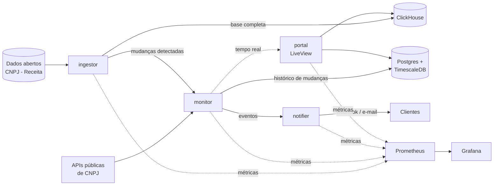

# 🐆 Lince

> Monitoramento contínuo de CNPJs: detecta mudanças cadastrais de empresas brasileiras e alerta em tempo real.


*[English version below](#-english)*

---

## O problema

Empresas se relacionam o tempo todo com outras empresas: fornecedores, clientes, parceiros. A situação dessas empresas muda: um CNPJ fica **inapto**, é **baixado**, troca de **razão social**, muda o **quadro societário** ou a **atividade econômica**.

Hoje essa verificação costuma ser manual e pontual: alguém consulta o CNPJ no cadastro e nunca mais olha. Quando o problema aparece (um pagamento para uma empresa baixada, um fornecedor irregular, um cliente com risco de fraude), já é tarde.

## A solução

O **Lince** acompanha continuamente uma carteira de CNPJs e avisa assim que algo muda.

- 📋 **Carteiras de monitoramento:** cada cliente cadastra os CNPJs que quer acompanhar.
- 🔔 **Alertas em tempo real:** notificação no painel, por e-mail e por webhook quando há mudança.
- 🕓 **Linha do tempo:** histórico completo de alterações de cada empresa.
- ⚠️ **Score de risco:** indicador baseado em situação cadastral, idade da empresa, mudanças recentes de sócios etc.
- 📊 **Analytics:** visão agregada da base nacional, como empresas abertas e fechadas por setor e UF.
- 🔌 **API pública:** integração com sistemas de terceiros (ERPs, onboarding de clientes, compliance).

**Para quem:** escritórios de contabilidade, fintechs, times de compliance/KYB e empresas com muitos fornecedores.

---

## Arquitetura

O sistema é dividido em **4 microserviços** em Elixir, que se comunicam por **APIs HTTP**.



### Serviços

| Serviço | Porta | Responsabilidade |
|---|---|---|
| **portal** | 4000 | Painel web em Phoenix LiveView: carteiras, alertas em tempo real, linha do tempo, analytics e autenticação multi-tenant |
| **monitor** | 4001 | Consulta periódica dos CNPJs monitorados, detecção de mudanças e registro do histórico |
| **ingestor** | 4002 | Download e processamento concorrente da base mensal de dados abertos da Receita; carga no ClickHouse e comparação entre meses |
| **notifier** | 4003 | Entrega de notificações (webhooks e e-mail) com retentativa e controle de falhas |

### Dados

| Banco | Uso | Por quê |
|---|---|---|
| **PostgreSQL + TimescaleDB** | Clientes, carteiras e histórico de mudanças por CNPJ | Dados transacionais com integridade relacional; o histórico de mudanças é uma série temporal, ideal para hypertables |
| **ClickHouse** | Base completa de empresas do Brasil e consultas analíticas | Dezenas de milhões de registros; consultas agregadas em segundos com armazenamento colunar |

---

## Stack

- **Linguagem:** Elixir / Erlang OTP
- **Web:** Phoenix, Phoenix LiveView
- **Jobs agendados:** Oban
- **Processamento concorrente:** Broadway / Flow
- **HTTP entre serviços:** Req
- **Bancos:** PostgreSQL + TimescaleDB, ClickHouse
- **Observabilidade:** PromEx, Prometheus, Grafana
- **Testes:** ExUnit, Mox
- **Infra local:** Docker Compose
- **CI/CD:** GitHub Actions
- **Deploy (planejado):** AWS, com infraestrutura como código

---

## Como rodar localmente

### Pré-requisitos

- Docker e Docker Compose
- Erlang/OTP 29 e Elixir 1.20 (recomendado instalar com [mise](https://mise.jdx.dev))

### Subindo a infraestrutura

```bash
git clone git@github.com:luizbahl/lince.git
cd lince
docker compose -f infra/docker-compose.yml up -d
```

| Serviço | Endereço | Credenciais |
|---|---|---|
| PostgreSQL + TimescaleDB | `localhost:54320` | postgres / postgres |
| ClickHouse | http://localhost:8123/play | lince / lince |
| Prometheus | http://localhost:9090 | — |
| Grafana | http://localhost:3000 | admin / admin |

> As instruções para rodar cada serviço serão adicionadas conforme forem implementados.

---

## Decisões técnicas

- **Microserviços com HTTP direto:** cada serviço tem uma responsabilidade clara e escala de forma independente; o `ingestor`, por exemplo, faz processamento pesado só uma vez por mês. A comunicação síncrona via HTTP mantém o sistema simples; filas seriam consideradas se o volume de eventos exigisse desacoplamento maior.
- **Dois bancos com papéis distintos:** OLTP (Postgres) para o que é transacional e OLAP (ClickHouse) para análise em grande volume, em vez de forçar um único banco a fazer as duas coisas.
- **Versões de imagens fixadas:** garantem reprodutibilidade. O ClickHouse está na versão **24.8 LTS** por compatibilidade com CPUs sem suporte a AVX.
- **Custo zero para desenvolver:** tudo roda localmente; o pipeline de deploy fica documentado e versionado.

---

## Roadmap

- [x] Infraestrutura local (Postgres/Timescale, ClickHouse, Prometheus, Grafana)
- [ ] **ingestor:** download e carga da base de dados abertos no ClickHouse
- [ ] **ingestor:** detecção de mudanças entre meses
- [ ] **monitor:** consulta periódica dos CNPJs monitorados com Oban
- [ ] **monitor:** histórico de mudanças em hypertable do TimescaleDB
- [ ] **notifier:** webhooks com retentativa e e-mail
- [ ] **portal:** autenticação e multi-tenancy
- [ ] **portal:** carteiras, alertas em tempo real e linha do tempo
- [ ] **portal:** dashboards analíticos com ClickHouse
- [ ] Score de risco
- [ ] Métricas com PromEx e dashboards no Grafana versionados
- [ ] CI com GitHub Actions (testes, lint, build)
- [ ] Pipeline de deploy na AWS (infraestrutura como código)
- [ ] API pública documentada

---

## Fonte dos dados

O Lince utiliza os **Dados Abertos do CNPJ**, publicados mensalmente pela Receita Federal, além de APIs públicas de consulta de CNPJ. São apenas informações públicas.

---

## 🇺🇸 English

**Lince** (*lynx*) continuously monitors Brazilian companies (CNPJ) and alerts users in real time when registry data changes, such as status, legal name, partners or economic activity.

It is built as **4 Elixir microservices** communicating over HTTP:

- **ingestor:** concurrently processes Brazil's monthly open company registry (tens of millions of records) into **ClickHouse** and detects month-over-month changes.
- **monitor:** periodically checks watched companies with **Oban** and stores the change history in **TimescaleDB** hypertables.
- **notifier:** delivers webhooks and e-mails with retries.
- **portal:** a multi-tenant **Phoenix LiveView** dashboard with real-time alerts, company timelines, risk scores and analytics.

Observability is handled with **PromEx, Prometheus and Grafana**, CI with **GitHub Actions**, and the AWS deployment pipeline is defined as code.

---

## Autor

**Luiz Bahl** · [GitHub](https://github.com/luizbahl)
